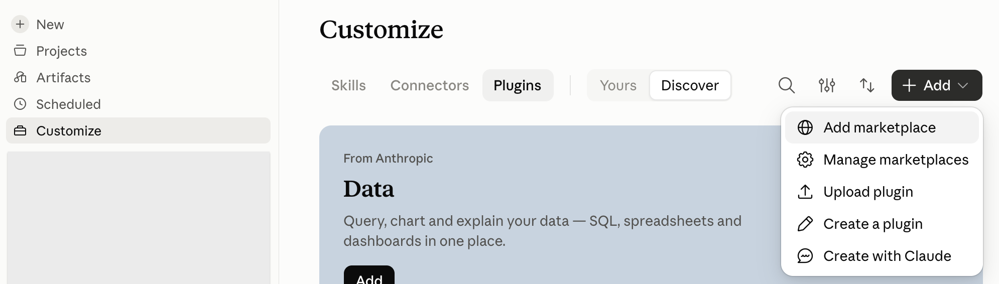
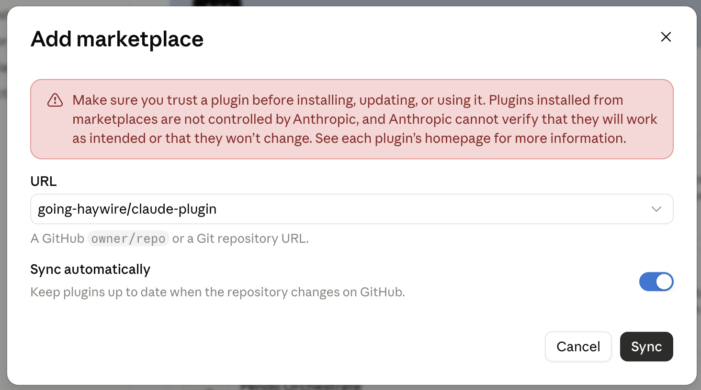
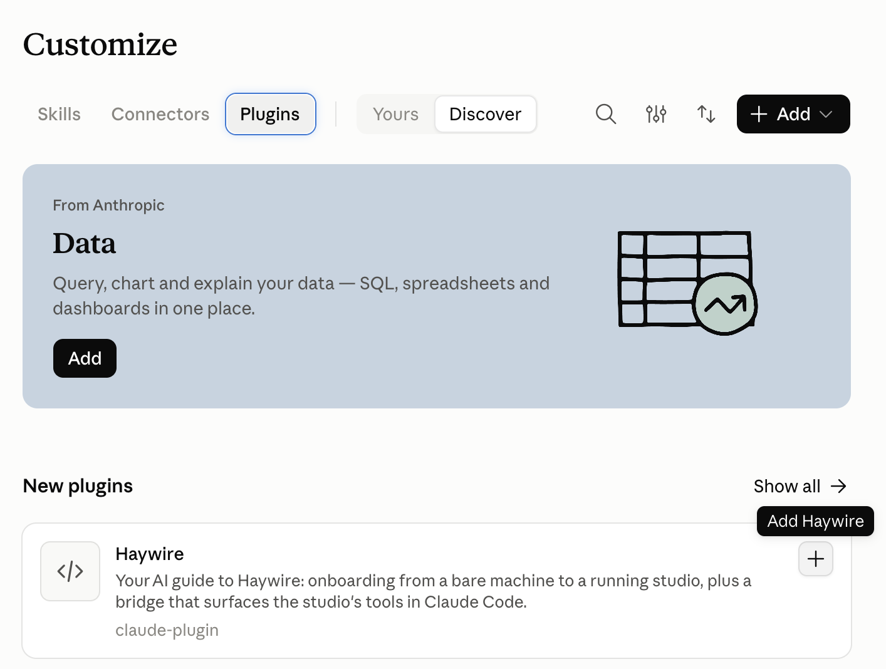
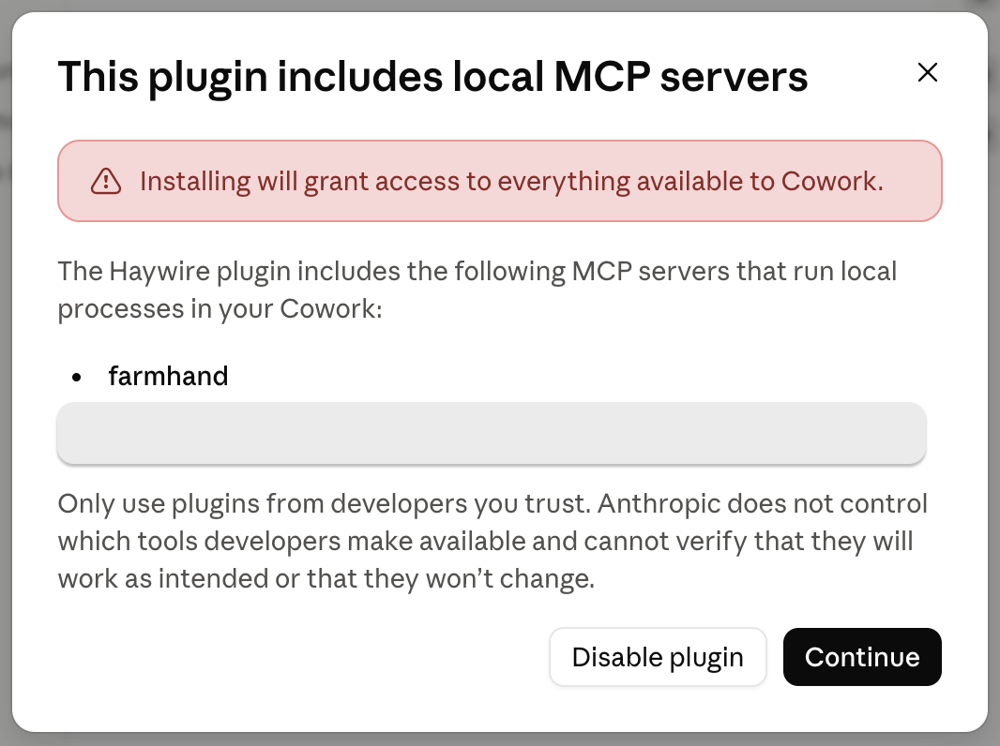
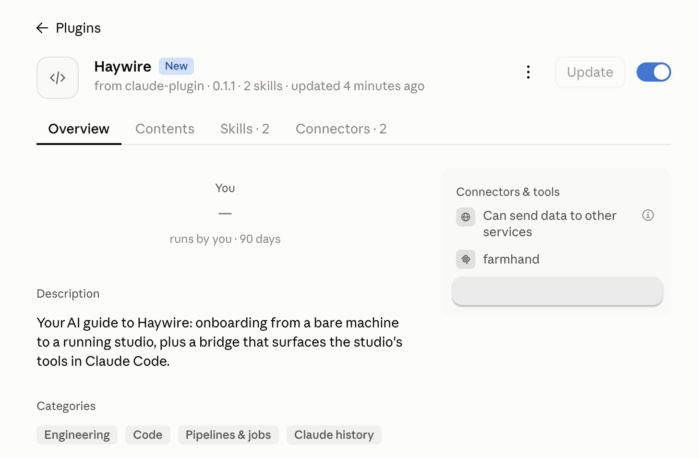
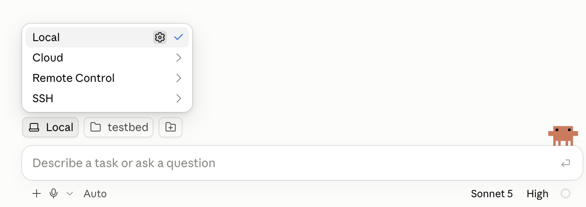

# claude-plugin

[](https://github.com/going-haywire/claude-plugin/actions/workflows/ci.yml)
[](https://www.npmjs.com/package/@going-haywire/farmhand-proxy)

**Your AI guide to [Haywire](https://github.com/going-haywire/haywire).** Install this plugin in
Claude and it takes you from a bare machine to a running Haywire studio. It checks your setup,
scaffolds a project and launches the studio, then stays connected so Claude can use the studio's
tools while you work.

> **Farmhand** is Haywire's name for its AI helper. The `haywire` plugin is the Claude Code half of
> it: an onboarding guide plus a bridge that makes the running studio's tools available in Claude.

## Who this is for

You want to try Haywire but you'd rather not live in a terminal. The plugin runs the console
commands for you and explains each step.

*(Comfortable in a terminal? The [Haywire README](https://github.com/going-haywire/haywire)'s
manual `uvx … haywire init` path is for you. You don't need this plugin.)*

## Before you start

The plugin checks for Python 3.12+, `uv` and git. If one is missing it shows you the install
command for your system and waits. It never installs them itself.

It also needs **Node.js 20 or newer**, which it can't check for you yet. If you don't have Node,
install the LTS version from [nodejs.org](https://nodejs.org) first.

## Install in the Claude desktop app

No terminal needed.

1. Install the Claude desktop app
   ([macOS](https://claude.ai/api/desktop/darwin/universal/dmg/latest/redirect) ·
   [Windows](https://claude.ai/api/desktop/win32/x64/setup/latest/redirect)) and sign in.
2. Add the Haywire marketplace. Click **Customize** in the sidebar and open **Plugins**. Click
   **Add** and choose **Add marketplace**.

   

   Paste `going-haywire/claude-plugin` and click **Sync**. Leave **Sync automatically** on so you
   get updates.

   

3. Install the plugin. In **Plugins**, find **Haywire** under **New plugins** and click **+**.

   

   A dialog warns that the plugin includes local MCP servers. `farmhand` is the bridge between
   Claude and your studio. Click **Continue**.

   

   Haywire now shows as installed and switched on.

   

4. Open the **Code** tab and start a new session. Choose **Local** and select an empty folder, for
   example one called `haywire-projects`. Your Haywire projects will live inside it.

   

5. Say **"help me get started with Haywire"** and follow along.

> **Use a local session in the Code tab.** The plugin also appears in the Chat and Cowork tabs,
> but it starts the studio on your computer and connects to it there, and a local Code session is
> where that works.

## Install in the Claude Code CLI

Add the marketplace and install the plugin from your shell:

```sh
claude plugin marketplace add going-haywire/claude-plugin
claude plugin install haywire@haywire-marketplace
```

You can also run the same two steps inside a Claude Code session:

```text
/plugin marketplace add going-haywire/claude-plugin
/plugin install haywire@haywire-marketplace
```

Then start Claude Code in the folder that should hold your Haywire projects:

```sh
mkdir haywire-projects
cd haywire-projects
claude
```

Say **"help me get started with Haywire"**, or run `/haywire:getting-started`.

## What happens next

The plugin checks your prerequisites, asks you for a project name, creates the project inside the
folder you opened and launches the studio in your browser. When the studio is up, its tools appear
in your Claude session on their own, with no restart.

With the studio running, say **"help me build my first graph"** (or run `/haywire:first-graph`)
for a guided first 15 minutes: adding and running a node, reading errors, installing a library.

## Updating

In the CLI:

```sh
claude plugin marketplace update haywire-marketplace
claude plugin update haywire@haywire-marketplace
```

Restart Claude Code afterwards.

In the desktop app, **Sync automatically** keeps the plugin up to date. If you turned it off, open
**Haywire** in **Customize → Plugins** and click **Update**. Then start a new session.

## Troubleshooting

**The studio's tools don't show up.** Start a new session. Claude connects the plugin's bridge to
the studio when a session starts, so a session you opened before installing the plugin doesn't have
it. In the CLI, `/mcp` lists the plugin's `farmhand` server and whether it's connected. If it
failed to start, check that Node.js 20+ is installed.

**Nothing happens when you ask to get started.** Make sure you're in a local session in the Code
tab (desktop app) and that the Haywire plugin is enabled.

## What's in the box

- **The `farmhand` proxy.** A small MCP server that connects Claude Code to your running studio.
  The studio's tools appear the moment the studio is up, without reconnecting. It works with any
  MCP client, but the guided setup only exists for Claude Code.
- **Onboarding skills.** `getting-started` takes you from a bare machine to a running studio.
  `first-graph` covers your first 15 minutes inside it.

## Status

The proxy is published on npm as
[`@going-haywire/farmhand-proxy`](https://www.npmjs.com/package/@going-haywire/farmhand-proxy).
The plugin (proxy + skills) installs from the `haywire-marketplace` marketplace in this repo.

## Development

The repo has two independent Node/TS packages, each with its own test suite:

```sh
cd proxy && npm install && npm test     # the MCP proxy + end-to-end harness
cd scripts && npm install && npm test   # doctor / studioctl / bootstrap
```

`npm run build` in either package runs `tsc`. The proxy bridges to the Haywire
studio's MCP endpoint, discovered from the studio's `.haywire/studio.json`
sidecar (falling back to `http://127.0.0.1:8124/mcp`) — see the
[haywire repo](https://github.com/going-haywire/haywire). CI
([`.github/workflows/ci.yml`](.github/workflows/ci.yml)) runs both suites on
Node 20 & 22 for every push and PR.

## Releasing (maintainers)

### Shipping plugin changes

Installed copies of the plugin only update when its `version` changes. Whenever skills, scripts or
the manifest change, bump `version` in **both** `.claude-plugin/plugin.json` and the plugin entry in
`.claude-plugin/marketplace.json`. Otherwise nobody who already installed the plugin gets the change.
`claude plugin validate .claude-plugin/plugin.json` checks the manifest, and `claude plugin tag`
refuses to tag a release when the two versions disagree.

### Publishing the proxy

The proxy publishes to npm automatically when you push a `v*` tag — the
[`publish.yml`](.github/workflows/publish.yml) workflow runs both test suites,
verifies the tag matches `proxy/package.json`'s version, then `npm publish`es.

### One-time setup (already done — recorded here so it can be redone)

The publish workflow needs an npm token stored as the repo secret `NPM_TOKEN`.
The npm account has 2FA, so the token **must** be allowed to bypass it:

1. On [npmjs.com](https://www.npmjs.com) → avatar → **Access Tokens** →
   **Generate New Token** → **Granular Access Token**.
2. Set:
   - ☑ **Bypass two-factor authentication** (required — without it CI's publish
     hangs waiting for an interactive 2FA prompt).
   - **Permissions: Read and write** (needed to publish).
   - **Packages and scopes:** scope it to **`@going-haywire`** (narrower than
     account-wide).
   - **Expiration:** pick a date; the token must be rotated when it expires.
3. Copy the token (npm shows it only once), then store it on the repo — the
   command prompts you to *paste* the token (keeps it out of shell history):

   ```sh
   gh secret set NPM_TOKEN --repo going-haywire/claude-plugin
   ```

   Verify with `gh secret list --repo going-haywire/claude-plugin` (shows the
   name + timestamp; the value is write-only and can't be read back).

### Cutting a release

```sh
# 1. Bump the version in proxy/package.json (e.g. 0.1.0 -> 0.1.1).
# 2. Commit it on main and push.
# 3. Tag with the SAME version, prefixed 'v', and push the tag:
git tag v0.1.1
git push origin v0.1.1
```

The tag push triggers `publish.yml`. Watch it with
`gh run watch` (or the Actions tab). The tag-vs-package version check will fail
the release if step 1 and step 3 disagree, so bump before you tag.

> **Manual publish** (if ever needed): `cd proxy && npm publish`. With 2FA on,
> npm opens a browser auth step — you must complete it, or the upload silently
> does not happen (the tarball notice prints but nothing lands on the registry).

## License

MIT
